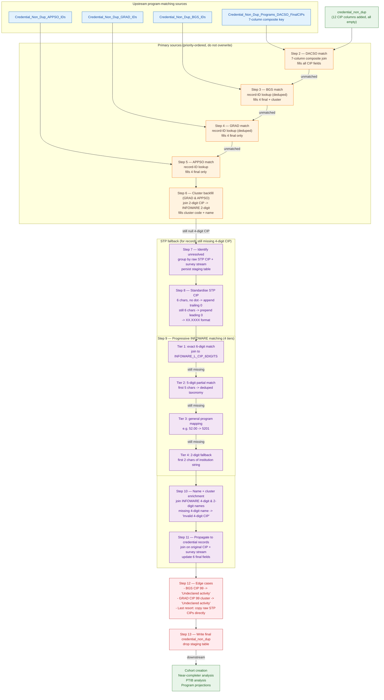

a Mermaid diagram illustrating the CIP matching pipeline:

### How to read the diagram

**Left-to-right flow** mirrors the 13 steps in the doc:

1. **Sources (top-left)** — Four upstream tables enter the merge, ordered by precision: DACSO (7-column composite key) is most precise, then BGS / GRAD / APPSO (record-ID lookups).
2. **Primary sources (Steps 2–6)** — Each step only fills records still missing a 4-digit CIP. DACSO populates the entire CIP family in one shot; BGS, GRAD, APPSO each contribute progressively. Step 6 backfills the cluster code for GRAD/APPSO from the INFOWARE 2-digit table.
3. **STP fallback (Steps 7–11)** — For records still unresolved, the institution-reported CIP is cleaned (Step 8) and then matched against INFOWARE through a four-tier waterfall: 6-digit → 5-digit → general-program → 2-digit.
4. **Edge cases & final write (Steps 12–13)** — CIP `99` / "Undeclared activity" labels, a last-resort raw-STP copy, and the overwrite of `credential_non_dup`.

The arrows from each step to the next are labelled with the gate condition (e.g. "unmatched", "still null 4-digit CIP"), so reviewers can see where each step cedes control to the next lower-priority source.