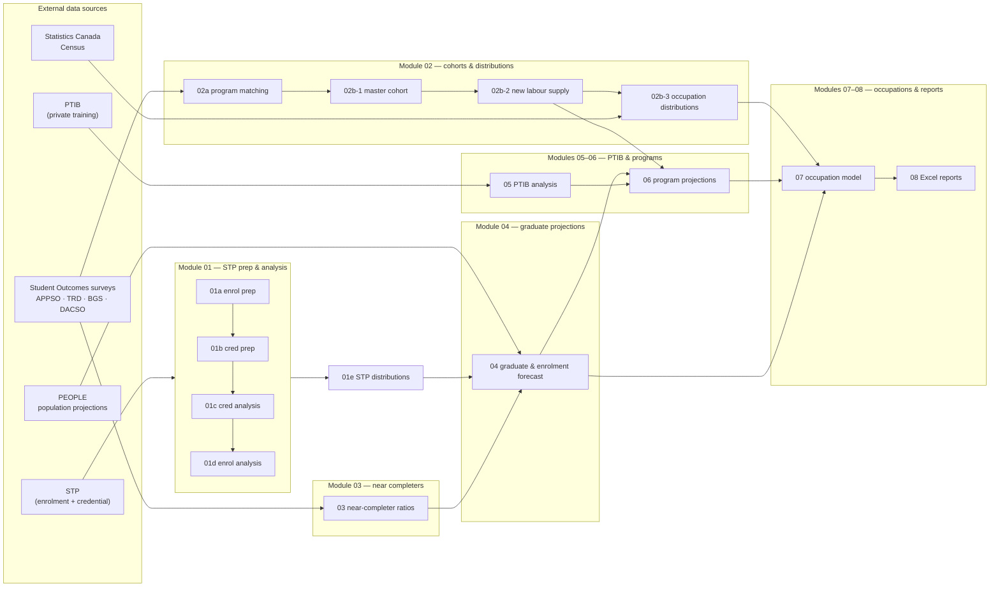
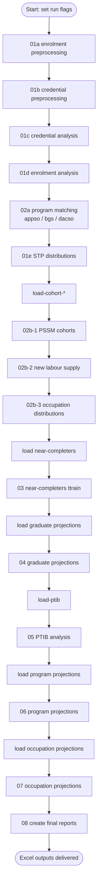
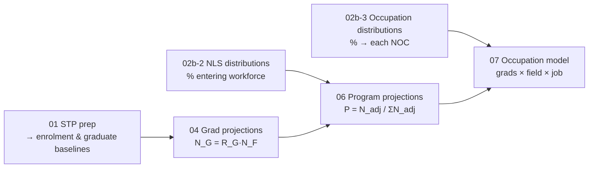

# Post-Secondary Supply Model (PSSM) — Summary for New Analysts

> A plain-language, technically-grounded orientation to the PSSM codebase.
> Companion to `README.md` and the per-module technical docs in `docs/`.

---

## 1. What this project does (the 30-second version)

The **Post-Secondary Supply Model (PSSM)** forecasts the future **supply** of
workers that BC's post-secondary system produces — graduates, near-completers,
apprentices, and private-training completers — and maps that supply onto
**occupations** (via the National Occupational Classification, NOC).

Think of it as answering:

> *"If BC's population grows and students keep enrolling at recent rates, how
> many graduates of each credential type, in each field of study, will enter the
> labour market each year — and what occupations will they likely work in?"*

The answer feeds provincial labour-market planning and is produced for three
regional scopes (the model is **run 3 times** — see §5).

---

## 2. Tech stack & how it runs

| Layer | Tooling |
|---|---|
| Language | **R** (primary) |
| Data store | **SQL Server** (the `decimal` database), via `DBI` + `odbc` |
| Secrets/config | `config.yml` read with the `config` package |
| Wrangling | `tidyverse` (`dplyr`, `tidyr`, `stringr`, …) |
| Reports | **Quarto** (`.qmd` files render the technical docs) + Excel outputs |

**Connecting to the database** (pattern repeated across every script):

```r
library(DBI); library(odbc); library(config)
db_config <- config::get("decimal")
con <- dbConnect(odbc(),
                 Driver   = db_config$driver,
                 Server   = db_config$server,
                 Database = db_config$database,
                 Trusted_Connection = "True")
df <- dbGetQuery(con, "SELECT * FROM <schema>.<table>")
```

Scripts are numbered `01a → 08` and are meant to run **in that order** (with the
notable exception of `01e`, which is run later). Each "analysis" script has a
companion `load-*.R` script that pulls its inputs.

---

## 3. The big picture — data flow



---

## 4. End-to-end run order



> **Heads-up:** Modules 02b → 07 are **flag-driven** because the model runs three
> times (§5). You must set the appropriate flags in your R session before each run.

---

## 5. The three model runs (important!)

Modules 02b onward are parameterised by **run flags**. The same scripts execute
**three times** with different input configurations (e.g. regional scope /
inclusion of certain cohorts). Before running each flagged section, set the
flags at the top of the script (this is a known WIP area — see commit history).

Build of the `tables_to_keep` cleanup list and the run-flag assignments are
themselves conditional on these flags, so getting them right is essential for a
clean, reproducible run.

---

## 6. Core concepts & vocabulary

| Term | Meaning |
|---|---|
| **STP** | Student Transitions Project — the master administrative dataset of BC enrolment + credentials. |
| **CIP code** | Classification of Instructional Programs — a field-of-study code. We use 2-digit (`LCIP2`) and 4-digit (`LCP4`) variants. |
| **NOC** | National Occupational Classification — 5-digit job code. The "destination" of a graduate. |
| **PEN** | Provincial Education Number — unique student key (`ENCRYPTED_TRUE_PEN`). |
| **Credential rank** | Numerical hierarchy of awards (Doctorate > Master's > Diploma …) used to pick each student's *peak* achievement. |
| **GRAD_STATUS** | 1 = credentialed graduate · 2 = completed activity, no credential · 3 = near-completer (≥24 credits, no award). |
| **Near-Completer** | A student who finished most of a program without a formal credential — counted as a *secondary supply stream*. |
| **NEW_LABOUR_SUPPLY (NLS)** | Derived flag: did this graduate actually enter the workforce? `0/1/2/3` (see §9). |
| **Composite keys** | Concatenations like `PSSM_CRED` = "1 - DIPL", `LCIP4_CRED` = "1 - 0100 - BACH" — used to match grads to jobs. |
| **APPSO / TRD / BGS / DACSO** | The four Student Outcomes survey streams: Apprenticeship, Trades, Baccalaureate Graduates, Diploma/Assoc/Certificate. |
| **PTIB** | Private Training Institutions Branch data (private, non-public colleges). |
| **PEOPLE** | BC Stats population projections used to drive enrolment forecasts. |
| **Delayed Award** | A secondary credential earned shortly after the primary one; exit date is reconciled forward by category-specific windows. |

---

## 7. Module-by-module, with the math

### Module 01 — STP preprocessing & analysis
*Scripts: `01a` enrolment, `01b` credential prep, `01c` credential analysis,
`01d` enrolment analysis, `01e` distributions.*

**What it does:** Cleans raw STP records, resolves conflicting birthdates,
classifies every record with a status code (0 = good, 1–8 = various exclusions),
imputes missing demographics, ranks credentials, and produces the enrolment /
graduate frequency baselines used downstream.

**Record status codes (0–8):** `0 Good`, `1 Missing ID`, `2 Developmental`,
`3 No Transition`, `5 Outside BC`, `6 Skills Based`, `7 Dev. CIP`,
`8 Certification`.

**Stratified stochastic gender imputation** preserves empirical demographic
variance instead of mode-filling:

$$W_g = \frac{n_g}{\sum n} \qquad G_{imputed} \sim \text{Categorical}(W_g \mid \text{credential category})$$

**Age carried forward** across a student's history so longitudinal ages stay
consistent:

$$A_{t} = A_{base} + (Year_{t} - Year_{base})$$

**Delayed-award reconciliation windows** (after the peak credential):
Apprenticeship/Bachelors/Professional = kept; Advanced Dip/Cert = 36 mo;
Masters/Grad Dip = 30 mo; Associate/basic Cert = 18 mo.

**Output:** the `qry09c_MinEnrolment*` tables and the credential distribution
matrix that feed Module 04.

---

### Module 02a — Program matching
*Scripts: `02a-appso-programs.R`, `02a-bgs-program-matching.R`,
`02a-dacso-program-matching.R`, `02a-update-cred-non-dup.R`.*

Cleans and standardises CIP codes across survey streams so records can be
matched in Module 02b.

---

### Module 02b-1 — Master cohort
*Script: `02b-1-pssm-cohorts.R`.*

Merges the four survey streams (APPSO, TRD, BGS, DACSO) into one **`t_cohorts_recoded`**
master table, joins model-year weights, derives a standardised `NEW_LABOUR_SUPPLY`
variable (the definition differs per survey), and builds the composite analytical
keys (`LCIP4_CRED`, `LCIP2_CRED`).

---

### Module 02b-2 — New Labour Supply (NLS) distributions
*Script: `02b-2-pssm-cohorts-new-labour-supply.R`.*

Estimates, per stratum, the **proportion of graduates that actually enter the
workforce**. This is the bridge between "graduate counts" and "labour supply".

**Step 1 — survey weight** (re-scales year weights by response rate):

$$SW_{ijk} = YW_{j} \times \frac{N_{ijk}}{R_{ijk}^{*}} \quad (^{*}\text{=}YW_j \text{ if } R_{ijk}=0)$$

**Step 2 — adjustment factor** (collapses the year level to keep proportions):

$$F_{ik} = \frac{\sum_j N_{ik}}{\sum_j n_{ik}} \quad (=0 \text{ if weighted}=0)$$

**Step 3 — final NLS weight & weighted estimate:**

$$NLSW_{ijk} = F_{ik} \times SW_{ijk}, \qquad a_{ijkl} = N_{ijkl} \times NLSW_{ijkl}$$

**Step 4 — regional proportion** of provincial NLS supply:

$$p_{il} = \frac{\sum_{k}\sum_{j} a_{ijkl}}{\sum_{k}\sum_{j}\sum_{l} a_{ijkl}}$$

*Indices:* `i` stratum (survey/age/grad status/CIP/cred), `j` year, `k` institution, `l` region.

---

### Module 02b-3 — Occupation distributions
*Script: `02b-3-pssm-cohorts-occupation-distributions.R`.*

Answers: **of the new labour supply in a stratum, what share goes to each NOC?**
Builds an occupation weight on top of the NLS weight.

**NLS base weight** (scales population by inverse response rate):

$$NLSBW_{ijkl} = NLSW_{ijkl} \times \frac{N_{ijkl}}{R_{ijkl}} \quad (=1 \text{ if } R_{ijkl}=0)$$

**Adjustment factor** (year-level collapse):

$$F_{ikl} = \frac{\sum_j BASE_{ijkl}}{\sum_j n_{ijkl}} \quad (=0 \text{ if weighted}=0)$$

**Final occupation weight & distribution:**

$$OCCW_{ijkl} = F_{ikl} \times NLSBW_{ijkl}, \qquad
WEIGHTED_{ijkln} = N_{ijkln} \times OCCW_{ijkl}$$

$$Percent_{iln} = \frac{\sum_{j,k} WEIGHTED_{ijkln}}{\sum_{j,k,n} WEIGHTED_{ijkln}}$$

Outputs include `occupation_distributions` plus `_lcp2`, `_bc`, `_no_tt`, and a
`_pdeg` (Professional Degree / Law) variant. Statistics Canada Census
distributions are appended for credential types the graduate surveys don't cover.

---

### Module 03 — Near-completer ratios
*Script: `03-near-completers-ttrain.R`.*

A "near-completer" finished ≥24 credits but earned no credential. This module
reconciles DACSO survey status against STP administrative credentials (a
4-criteria match: credential type, CIP, school year, institution) and *promotes*
near-completers who are later confirmed to have graduated. The residual is the
true near-completer population.

$$NC_{Residual} = NC_{Survey} - NC_{Promoted}$$

$$Ratio_{Baseline} = \frac{NC_{Residual}}{Completers_{Survey}}, \qquad
Ratio = \frac{NC_{Residual}}{Completers_{Survey+STP}}$$

Produces ratios stratified by age, gender, 4-digit CIP, and credential; also by
year. The 2018–2019 baseline cycle is used for the PSSM 2023 model.

---

### Module 04 — Graduate projections
*Script: `04-graduate-projections.R`.*

Forecasts enrolment and graduates for a 12-year horizon.

**Historical enrolment rate** (% of provincial population):

$$R_E = 100 \times \frac{N_E}{N_P}, \quad 2002 < t < 2022$$

**Forecast rate** via linear regression for 2023–2027, then **held flat**
through 2034 to stabilise long-term divergence:

$$R_F = \beta_0 + \beta_1 \cdot Yr$$

**Forecast enrolment** from PEOPLE population:

$$N_F = R_F \times N_P \times 0.01$$

**Graduation rate** (2-yr average) applied to forecast enrolment:

$$R_G = \frac{N_G}{N_E}, \qquad N_G = R_G \times N_F$$

**Near-completer** and **apprenticeship** supply are layered on top:

$$N_{G_{NC}} = N_G \times R_{C_{NC}}, \qquad
N_{G_{AP}} = \text{mean}(N_{G_{AP,2022}}, N_{G_{AP,2023}})$$

Output tables: `Graduate_Projections` and `Graduate_Projections_Include_Historical`.

---

### Module 05 — PTIB (private training) analysis
*Script: `05-ptib-analysis.R`.*

Estimates domestic graduates from private institutions where immigration status
is often blank. A **domestic participation rate** proportionally attributes the
"unknown" cohort:

$$R = \frac{K_d}{K_{d+i}}, \qquad G = \sum \bigl(K_d + (K_u \times R)\bigr)$$

($K_d$ known domestic, $K_i$ international, $K_u$ unknown; $R=0$ if no known
population in the stratum.) A 2-year mean (2021–2022) is then projected 10 years.

---

### Module 06 — Program projections
*Script: `06-program-projections.R`.*

Distributes the Module 04 graduate totals **across CIP codes** (i.e. fields of
study) using historical, year-weighted relative frequencies.

**Weighted baseline** (recent years weighted more):

$$N_{base} = \sum_{year}(N \times W_{year}), \qquad W_{year} \in \{1..5\}$$

**TTRAIN adjustment** (≈ identity for most strata): $N_{adj} = N_{base} \times R$

**Standardised proportion** of each stratum:

$$P = \frac{N_{adj}}{\sum N_{adj}}$$

Two registries are produced: a **Projected Series** (PTIB + qry10c/12c/13d/14e)
and a **Static Series** (Q012e/013e/014e + qry_13d), projected to 2035/2036.

---

### Module 07 — Occupation projections
*Script: `07-occupation-projections.R`.*

Combines program-level graduate projections (06) with the occupation
distributions (02b-3) to produce the final **graduate → occupation** supply
model. This is the headline output of PSSM.

### Module 08 — Final reports
*Script: `08-create-final-reports.R`.* Formats everything into Excel deliverables.

---

## 7½. How the modules compose (one-line each)



---

## 8. Key output tables (what to look for)

| Table | From | Contains |
|---|---|---|
| `qry09c_MinEnrolment*` | 01e | Historical enrolment frequency baseline |
| `t_cohorts_recoded` | 02b-1 | Unified master survey cohort |
| `labour_supply_distribution*` | 02b-2 | NLS weighted proportions |
| `occupation_distributions*` | 02b-3 | Weighted grad→NOC distributions |
| `t_dacso_near*_ratio*` | 03 | Near-completer ratios (age/gender/year/CIP) |
| `Graduate_Projections[_Include_Historical]` | 04 | 12-yr grad + near-completer + apprenticeship |
| `qry_Private_Credentials_*` | 05 | PTIB domestic grad estimates |
| `cohort_program_distributions_projected/static` | 06 | CIP-level program distributions |
| Final occupation supply | 07 | Headline PSSM output |

---

## 9. NEW_LABOUR_SUPPLY (NLS) codes — quick reference

| Code | Meaning |
|---|---|
| **0** | Not new labour supply (or no response — BGS only) |
| **1** | In the workforce at time of survey |
| **2** | Studying **and** working (DACSO only) |
| **3** | *Derived* — NLS-2 with no matching NLS-1 history (assigned in 02b-2/3) |

---

## 10. Getting started checklist

1. ✅ Get **SQL Server access** to the `decimal` database (Trusted/Windows auth).
2. ✅ Put a `config.yml` with the `decimal` connection block at the project root.
3. ✅ Install R packages: `tidyverse`, `DBI`, `odbc`, `config`, `readxl`,
   `janitor`, `glue`, `assertthat`, plus Quarto for rendering `.qmd` docs.
4. ✅ Be on the **secure LAN** (some sources like PTIB live on LAN file shares).
5. ✅ Read the per-module `.qmd` files in `docs/` for full detail; render with
   `quarto preview docs/<file>.qmd`.
6. ✅ Skim the **PSSM Analyst Manual** HTML in `docs/` for the run procedure.
7. ✅ Before any flagged run, set the run flags (§5) at the top of the scripts.

---

## 11. Where to look next

- **Project entry point:** `README.md`
- **Per-module methodology & data dictionaries:** every `*.qmd` in `docs/`
- **Run procedure:** `docs/PSSM Analyst Manual - Running the Mode.html`
- **Issues/contributing:** GitHub issues + `CONTRIBUTING.md`, `CODE_OF_CONDUCT.md`

*License: Apache 2.0 — © Province of British Columbia.*
