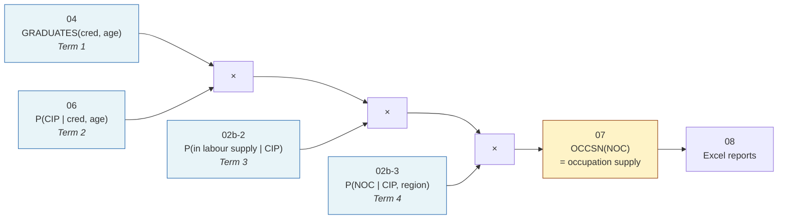
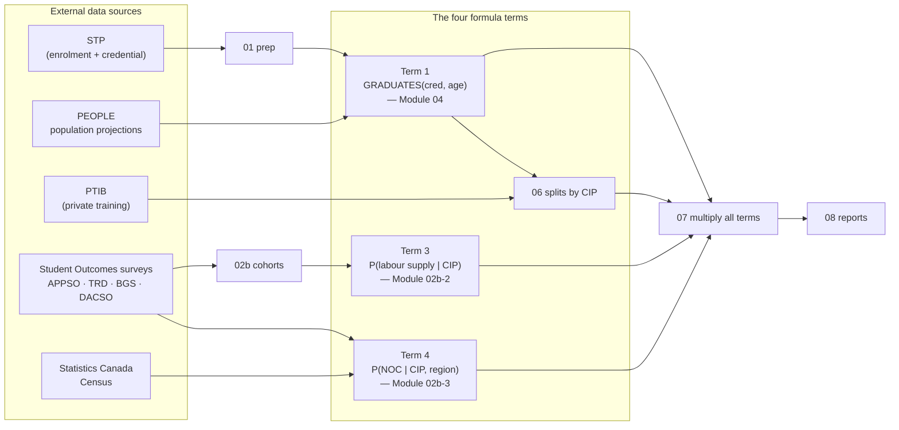
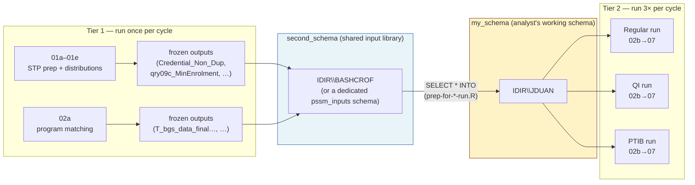
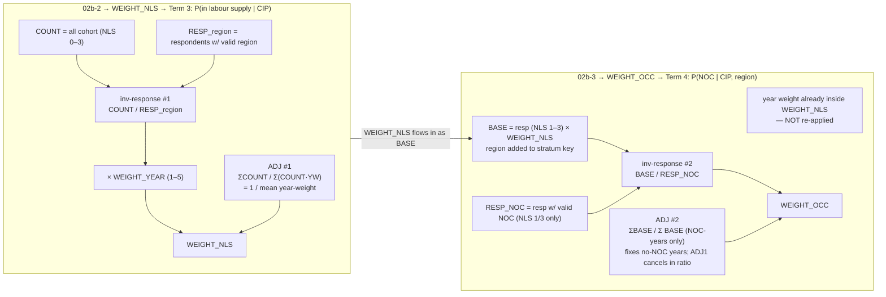

# Post-Secondary Supply Model (PSSM) — Summary for New Analysts

> A plain-language, technically-grounded orientation to the PSSM codebase.
> Companion to `README.md` and the per-module technical docs in `docs/`.
>
> **Read §2 first.** The whole project exists to compute one formula. Every
> module is a step toward filling in one of its four terms. If you remember
> nothing else, remember that formula — it is the map that stops the detail
> from becoming a maze.

---

## 1. What this project does (the 30-second version)

The **Post-Secondary Supply Model (PSSM)** forecasts the future **supply** of
workers that BC's post-secondary system produces — graduates, near-completers,
apprentices, and private-training completers — and maps that supply onto
**occupations** (via the National Occupational Classification, NOC).

Think of it as answering:

> *"If BC's population grows and students keep enrolling at recent rates, how
> many graduates of each credential type, in each field of study, will enter the
> labour market each year — and what occupations will they likely work in?"*

The answer feeds provincial labour-market planning and is produced for three
regional scopes (the model is **run 3 times** — see §6).

---

## 2. THE KEY FORMULA — the spine of the whole project

Everything PSSM does is in service of one decomposition. It appears as a comment
at the top of `02b-2` and `02b-3`, and it is the single most important thing to
internalize:

$$
\boxed{\;
\text{OCCSN}(\text{NOC})
= \underbrace{\text{GRADUATES}(\text{cred, age})}_{\textbf{Module 04}}
\;\times\;
\underbrace{P(\text{CIP} \mid \text{cred, age})}_{\textbf{Module 06}}
\;\times\;
\underbrace{P(\text{in labour supply} \mid \text{CIP})}_{\textbf{Module 02b-2}}
\;\times\;
\underbrace{P(\text{NOC} \mid \text{CIP, region})}_{\textbf{Module 02b-3}}
\;}
$$

Read it as a sentence:

> **Number of people supplying labour to occupation X** =
> how many **graduate** (by credential & age)
> × of those, what **field of study** are they in
> × of those, what fraction **actually enter the workforce**
> × of those who do, what **occupation** do they work in.

Each `×` is a conditional probability that shrinks the cohort down to the people
who actually arrive in a given occupation.

### How every module plugs into the formula

| Module | Role | Feeds which term |
|---|---|---|
| **01** STP prep | Cleans enrolment + credential records; builds the **graduate and enrolment baselines** | upstream input to **GRADUATES** (via 01e → 04) |
| **02a** Program matching | Standardises CIP codes so records can be matched | enables all CIP-conditional terms |
| **02b-1** Master cohort | Unifies the four survey streams into `t_cohorts_recoded` with weights + NLS flag | the **population** 02b-2 and 02b-3 weight up |
| **02b-2** New Labour Supply | Produces **$P(\text{in labour supply} \mid \text{CIP})$** | **Term 3** directly |
| **02b-3** Occupation dist. | Produces **$P(\text{NOC} \mid \text{CIP, region})$** | **Term 4** directly |
| **03** Near-completers | Adds a *secondary* supply stream (people who nearly finished) into GRADUATES | expands **GRADUATES** |
| **04** Graduate projections | Forecasts **GRADUATES(cred, age)** for 12 years | **Term 1** directly |
| **05** PTIB | Adds private-training graduates to the supply pool | expands **GRADUATES** |
| **06** Program projections | Distributes GRADUATES across CIP codes → **$P(\text{CIP}\mid\text{cred, age})$** | **Term 2** directly |
| **07** Occupation projections | **Multiplies all four terms together** — this is where the formula is *evaluated* | **the formula** |
| **08** Final reports | Formats Module 07's output into Excel | delivery |

> **Mental model:** Modules 01–06 each *prepare one factor* of the formula.
> Module 07 *multiplies them together*. Module 08 *publishes the result*.
> If you ever feel lost in a script, ask: *"which term of the formula is this
> helping to compute?"* — that will re-orient you.

### The formula as a pipeline



---

## 3. Tech stack & how it runs

| Layer | Tooling |
|---|---|
| Language | **R** (primary) |
| Data store | **SQL Server** (the `decimal` database), via `DBI` + `odbc` |
| Secrets/config | `config.yml` read with the `config` package |
| Wrangling | `tidyverse` (`dplyr`, `tidyr`, `stringr`, …) |
| Reports | **Quarto** (`.qmd` files render the technical docs) + Excel outputs |

**Connecting to the database** (pattern repeated across every script):

```r
library(DBI); library(odbc); library(config)
db_config <- config::get("decimal")
con <- dbConnect(odbc(),
                 Driver   = db_config$driver,
                 Server   = db_config$server,
                 Database = db_config$database,
                 Trusted_Connection = "True")
df <- dbGetQuery(con, "SELECT * FROM <schema>.<table>")
```

Scripts are numbered `01a → 08` and are meant to run **in that order** (with the
notable exception of `01e`, which is run later). Each "analysis" script has a
companion `load-*.R` script that pulls its inputs.

---

## 4. End-to-end run order

```mermaid
flowchart TD
    Start([Start: set run flags]) --> S01a[01a enrolment preprocessing]
    S01a --> S01b[01b credential preprocessing]
    S01b --> S01c[01c credential analysis]
    S01c --> S01d[01d enrolment analysis]

    S01d --> S02a[02a program matching<br/>appso / bgs / dacso]
    S02a --> S01e[01e STP distributions]
    S01e --> L02b[load-cohort-*]

    L02b --> S02b1[02b-1 PSSM cohorts]
    S02b1 --> S02b2[02b-2 new labour supply<br/>→ <b>Term 3</b>]
    S02b2 --> S02b3[02b-3 occupation distributions<br/>→ <b>Term 4</b>]

    S02b3 --> LNC[load near-completers]
    LNC --> S03[03 near-completers ttrain]

    S03 --> LGP[load graduate projections]
    LGP --> S04[04 graduate projections<br/>→ <b>Term 1</b>]

    S04 --> LPT[load-ptib]
    LPT --> S05[05 PTIB analysis]

    S05 --> LPP[load program projections]
    LPP --> S06[06 program projections<br/>→ <b>Term 2</b>]

    S06 --> LOP[load occupation projections]
    LOP --> S07[07 occupation projections<br/>→ <b>multiplies the formula</b>]
    S07 --> S08[08 create final reports]
    S08 --> Done([Excel outputs delivered])
```



> **Critical distinction — two tiers of scripts:**
> - **Tier 1 — Input preparation (`01a–01e`, `02a`):** run **once per model
>   cycle** (not per run). They are *expensive* (full STP scrape, imputation,
>   CIP matching) and their outputs are **frozen** as inputs to all three model
>   runs. See §6 for where these frozen inputs live.
> - **Tier 2 — The three model runs (`02b–07`):** run **three times** with
>   different flags. They consume the frozen Tier-1 inputs and write into the
>   analyst's own schema.
>
> The run-order diagram above shows Tier 1 and Tier 2 as one continuous chain
> for readability, but in practice Tier 1 is run ahead of time and its outputs
> are *copied* into each analyst's schema before the Tier-2 loop begins
> (§6 explains the mechanism).

---

## 5. The big picture — data flow mapped to the formula



---

## 6. The three model runs & the two-schema design (important!)

### 6.1 Why the model runs three times

Modules 02b onward are parameterised by **run flags**. The same scripts execute
**three times** with different configurations, producing three variants of the
occupation-supply output:

| Run | Flag set | What differs |
|---|---|---|
| **Regular** | `regular_run = T` | The headline provincial model. |
| **QI** | `qi_run = T` | Quality-Indicator run: year weights rolled back, 2023 survey responses zeroed, used to assess per-NOC quality. |
| **PTIB** | `ptib_run = T` | Re-runs `06→07` with private-training (PTIB) supply folded into the program distributions. |

Each run is launched by its own prep script — `prep-for-fresh-run.R`,
`prep-for-qi-run.R`, `prep-for-ptib-run.R` — and the orchestrator
`run_all_three_model_runs.r` runs them in sequence then calls `08-create-final-reports.R`.
Build of the `tables_to_keep` cleanup list and several code branches are
themselves conditional on these flags, so getting them right is essential.

### 6.2 The two-schema design — and why it exists

A key design choice follows from the Tier-1/Tier-2 split in §4:

> **Tier-1 outputs (from `01` and `02a`) are identical across all three model
> runs, so they are produced once, stored in a shared schema, and *copied* into
> each analyst's working schema at the start of every run.**

`config.yml` defines two schemas for this purpose:

```yaml
myschema:      "IDIR\\myschema"      # the analyst's own working schema (Tier-2 writes go here)
second_schema: "IDIR\\dboorotheruser"   # shared input library — frozen Tier-1 outputs live here
```

The copy happens in `prep-for-fresh-run.R` (and the QI/PTIB prep scripts), which
runs a `copy_tables` list:

```r
copy_tables <- c(
  '[{second_schema}]."T_bgs_data_final_for_outcomesmatching_r"',  # from 02a
  '[{second_schema}]."Credential_Non_Dup_r"',                      # from 01c
  '[{second_schema}]."STP_Credential_r"',                          # from PSFS
  '[{second_schema}]."qry09c_minenrolment_r"',                     # from 01e  → feeds Term 1
  '[{second_schema}]."Credential_By_Year_Gender_AgeGroup_..._r"',  # from 01e  → feeds Term 1
  '[{second_schema}]."tbl_credential_highest_rank_r"',             # from 01c
  '[{second_schema}]."Labour_Supply_Distribution_Stat_Can"',       # external
  '[{second_schema}]."Occupation_Distributions_Stat_Can"'          # external
)
for (table in copy_tables) {
  dbExecute(con, glue('SELECT * INTO [{my_schema}].{t} FROM {table};'))
}
```



**Why this design is deliberate:**

1. **Reproducibility across analysts.** Every analyst starts from the *same*
   frozen Tier-1 inputs, so any difference in the three runs is attributable to
   the flag logic, not to divergent upstream cleaning. Without this, two analysts
   re-running `01c` could silently produce different `Credential_Non_Dup` tables
   (e.g. due to the stochastic imputation with `set.seed`) and get different
   occupation supply with no obvious cause.
2. **Speed.** Tier 1 is the slow, expensive part (full STP scrape, CIP matching,
   imputation). Tier 2 (`02b–07`) is comparatively fast. The design lets an
   analyst iterate on the three runs in minutes without paying the Tier-1 cost
   each time.
3. **Isolation / safe experimentation.** Tier-2 writes go to the analyst's own
   `my_schema`, so a botched run, a dropped table, or an experimental tweak
   never corrupts the shared inputs or another analyst's work.
4. **Controlled change management.** Tier-1 outputs only change when someone
   deliberately re-runs `01`/`02a` and refreshes `second_schema` — making it a
   versioned, reviewable hand-off rather than silent drift.

### 6.3 Rough edges in the current implementation (and a path forward)

The two-schema *idea* is sound, but the current code has some inconsistencies a
new analyst should know about:

- **Schema source is inconsistent across prep scripts.** `prep-for-fresh-run.R`
  copies Tier-1 tables from `second_schema` with an `_r` suffix (e.g.
  `Credential_Non_Dup_r`), but `prep-for-ptib-run.R` copies `Credential_Non_Dup`
  from `dbo` with no suffix. A `TODO: copy tables from bonnie's schema with _r`
  comment in `prep-for-fresh-run.R` flags that this isn't settled. An analyst can
  easily grab the wrong vintage of an input depending on which prep script ran.
- **The "shared library" is a person's IDIR schema** (`IDIR\BASHCROF`), not a
  purpose-built schema. It's implicit, not documented as the canonical input
  store, and its lifetime is tied to that person's account.
- **The copy list is hand-maintained** in three places (the three prep scripts),
  so the same table appears under different names/suffixes and can drift out of
  sync.
- **`prep-for-fresh-run.R` Option 1** will drop *every* table in `my_schema`
  (except `_raw` suffixed ones). Powerful, but easy to lose work if mis-run.

**Potential improvement — promote the shared library to a first-class
`pssm_inputs` schema.** Concretely:

1. **Create a dedicated schema** (e.g. `pssm_inputs`) owned by the team, not an
   individual IDIR. Move all Tier-1 frozen outputs and the StatCan inputs there.
   This makes the input library explicit, survives staff turnover, and can be
   permission-locked to read-only for analysts.
2. **Adopt one naming convention** — drop the `_r` suffix inconsistency. Every
   Tier-1 output in `pssm_inputs` uses its canonical name (e.g.
   `Credential_Non_Dup`, `qry09c_MinEnrolment`). The `_r` convention was a
   workaround for writing R-produced tables next to SQL-produced ones in the same
   schema; a dedicated input schema removes the collision.
3. **Centralise the manifest.** Replace the three hand-maintained `copy_tables`
   vectors with a single config-driven list (e.g. a `tier1_inputs.yml` or a
   `t_input_manifest` table in `pssm_inputs`):

   ```yaml
   # tier1_inputs.yml — the single source of truth
   - name: Credential_Non_Dup           # canonical name in pssm_inputs
     source_script: 01c                 # for traceability
     feeds_terms: [1]                   # which formula term(s)
   - name: qry09c_MinEnrolment
     source_script: 01e
     feeds_terms: [1]
   - name: T_bgs_data_final_for_outcomesmatching
     source_script: 02a
     feeds_terms: [3, 4]
   # …
   ```

   All three prep scripts read this manifest, so the copy list can't drift.
4. **Version the inputs.** Add a `t_input_versions` table (or a schema-level
   `pssm_inputs_2023`, `pssm_inputs_2024`) recording the model cycle, run date,
   and git commit of the Tier-1 scripts that produced each table. Then a run's
   provenance — *which exact vintage of `Credential_Non_Dup` fed these
   occupation projections?* — is queryable rather than tribal knowledge.
5. **Add a preflight check.** A small `verify_inputs()` function called at the
   top of every prep script that asserts each manifest table exists in
   `pssm_inputs`, is non-empty, and matches a recorded row count/hash. This
   turns "wrong vintage" into a loud, early failure instead of a silent
   numerical difference three modules later.

The migration is low-risk because it's mostly mechanical: rename the copy
targets, point `second_schema` at `pssm_inputs`, and consolidate the three lists
— no model logic changes. The payoff is that the two-schema design becomes
self-documenting and analyst-proof, which is the whole point of freezing Tier-1
outputs in the first place.

---

## 7. Core concepts & vocabulary

| Term | Meaning |
|---|---|
| **STP** | Student Transitions Project — the master administrative dataset of BC enrolment + credentials. |
| **CIP code** | Classification of Instructional Programs — a field-of-study code. We use 2-digit (`LCIP2`) and 4-digit (`LCP4`) variants. Appears in Terms 2, 3, 4. |
| **NOC** | National Occupational Classification — 5-digit job code. The "destination" of a graduate. The left-hand side of the formula. |
| **PEN** | Provincial Education Number — unique student key (`ENCRYPTED_TRUE_PEN`). |
| **Credential rank** | Numerical hierarchy of awards (Doctorate > Master's > Diploma …) used to pick each student's *peak* achievement. |
| **GRAD_STATUS** | 1 = credentialed graduate · 2 = completed activity, no credential · 3 = near-completer (≥24 credits, no award). |
| **Near-Completer** | A student who finished most of a program without a formal credential — counted as a *secondary supply stream* feeding Term 1. |
| **NEW_LABOUR_SUPPLY (NLS)** | Derived flag: did this graduate actually enter the workforce? `0/1/2/3` (see §11). The basis of Term 3. |
| **Composite keys** | Concatenations like `PSSM_CRED` = "1 - DIPL", `LCIP4_CRED` = "1 - 0100 - BACH" — used to match grads to jobs across terms. |
| **APPSO / TRD / BGS / DACSO** | The four Student Outcomes survey streams: Apprenticeship, Trades, Baccalaureate Graduates, Diploma/Assoc/Certificate. |
| **PTIB** | Private Training Institutions Branch data (private, non-public colleges) — feeds Term 1/2. |
| **PEOPLE** | BC Stats population projections used to drive enrolment forecasts in Term 1. |
| **Delayed Award** | A secondary credential earned shortly after the primary one; exit date is reconciled forward by category-specific windows. |

---

## 8. Module-by-module, mapped to the formula

> Each module section opens with **which term it serves**, so you always know
> where you are in the decomposition.

### Module 01 — STP preprocessing & analysis  *(upstream of Term 1)*
*Scripts: `01a` enrolment, `01b` credential prep, `01c` credential analysis,
`01d` enrolment analysis, `01e` distributions.*

**Serves:** builds the historical **graduate and enrolment baselines** that
Module 04 turns into `GRADUATES(cred, age)` (Term 1).

Cleans raw STP records, resolves conflicting birthdates, classifies every record
with a status code (0 = good, 1–8 = various exclusions), imputes missing
demographics, ranks credentials, and produces the enrolment / graduate frequency
baselines.

**Record status codes (0–8):** `0 Good`, `1 Missing ID`, `2 Developmental`,
`3 No Transition`, `5 Outside BC`, `6 Skills Based`, `7 Dev. CIP`,
`8 Certification`.

**Stratified stochastic gender imputation** preserves empirical demographic
variance instead of mode-filling:

$$W_g = \frac{n_g}{\sum n} \qquad G_{imputed} \sim \text{Categorical}(W_g \mid \text{credential category})$$

**Age carried forward** across a student's history so longitudinal ages stay
consistent:

$$A_{t} = A_{base} + (Year_{t} - Year_{base})$$

**Delayed-award reconciliation windows** (after the peak credential):
Apprenticeship/Bachelors/Professional = kept; Advanced Dip/Cert = 36 mo;
Masters/Grad Dip = 30 mo; Associate/basic Cert = 18 mo.

**Output:** the `qry09c_MinEnrolment*` tables and the credential distribution
matrix that feed Module 04.

---

### Module 02a — Program matching  *(enables CIP-conditional terms 2/3/4)*
*Scripts: `02a-appso-programs.R`, `02a-bgs-program-matching.R`,
`02a-dacso-program-matching.R`, `02a-update-cred-non-dup.R`.*

**Serves:** cleans and standardises CIP codes across survey streams so records
can be matched in Module 02b. Without this, the CIP keys in Terms 2–4 wouldn't
join.

---

### Module 02b-1 — Master cohort  *(the population that 02b-2 & 02b-3 weight)*
*Script: `02b-1-pssm-cohorts.R`.*

**Serves:** produces `t_cohorts_recoded`, the unified survey cohort that
02b-2 and 02b-3 turn into Terms 3 and 4.

Merges the four survey streams (APPSO, TRD, BGS, DACSO) into one master table,
joins model-year weights, derives a standardised `NEW_LABOUR_SUPPLY` variable
(the definition differs per survey), and builds the composite analytical keys
(`LCIP4_CRED`, `LCIP2_CRED`).

---

### Module 02b-2 — New Labour Supply distributions  *(produces Term 3)*
*Script: `02b-2-pssm-cohorts-new-labour-supply.R`.*

**Serves:** produces **$P(\text{in labour supply} \mid \text{CIP})$** — Term 3
of the formula. This is the proportion of graduates who actually enter the
workforce, by field of study.

**Why weighting is needed here:** survey *respondents* are not the same as the
full cohort — some don't respond, some have missing region. To estimate the
*true* participation rate, each respondent is weighted up to stand for the
non-respondents in their stratum. The full weight derivation is in §9 below;
the end product is `labour_supply_distribution`, whose `New_Labour_Supply` column
*is* Term 3.

**The participation rate (Term 3) itself:**

$$P(\text{in labour supply}\mid\text{CIP, age, region})
= \frac{\text{WEIGHTED}_{\text{NLS 1--3, region}}}{\text{WEIGHTED}_{\text{NLS 0--3, all regions}}}$$

> See §9 for how `WEIGHTED` (i.e. `WEIGHT_NLS`) is constructed and why the
> two-stage weighting is **not** a double adjustment.

---

### Module 02b-3 — Occupation distributions  *(produces Term 4)*
*Script: `02b-3-pssm-cohorts-occupation-distributions.R`.*

**Serves:** produces **$P(\text{NOC} \mid \text{CIP, region})$** — Term 4 of the
formula. Of the people who enter the labour supply in a CIP/region, what share
goes to each occupation?

**Why a second weight is needed:** Term 4 is *conditional on being in the labour
supply* (NLS 1–3), but many respondents have no usable NOC, and NLS=2 people are
excluded from the NOC denominator. A second weight (`WEIGHT_OCC`) is built *on
top of* `WEIGHT_NLS` to upweight NOC-respondents to cover that gap. Full
derivation in §9; the end product is `occupation_distributions`.

**The occupation distribution (Term 4) itself:**

$$P(\text{NOC}\mid\text{CIP, region})
= \frac{\sum_{j,k}\text{WEIGHTED}_{ijkln}}{\sum_{j,k,n}\text{WEIGHTED}_{ijkln}}$$

Outputs include `occupation_distributions` plus `_lcp2`, `_bc`, `_no_tt`, and a
`_pdeg` (Professional Degree / Law) variant. Statistics Canada Census
distributions are appended for credential types the graduate surveys don't cover.

> **The two-step weighting in 02b-2 then 02b-3 is the most confusing part of the
> codebase.** It is fully unpacked in §9, including a direct answer to the
> common question: *"isn't applying inverse response rates and adjustment
> factors twice a double adjustment?"* (Spoiler: no.)

---

### Module 03 — Near-completer ratios  *(expands Term 1)*
*Script: `03-near-completers-ttrain.R`.*

**Serves:** adds a *secondary* supply stream into `GRADUATES` (Term 1). A
"near-completer" finished ≥24 credits but earned no credential — they still
represent labour-market supply.

This module reconciles DACSO survey status against STP administrative
credentials (a 4-criteria match: credential type, CIP, school year, institution)
and *promotes* near-completers who are later confirmed to have graduated. The
residual is the true near-completer population.

$$NC_{Residual} = NC_{Survey} - NC_{Promoted}$$

$$Ratio_{Baseline} = \frac{NC_{Residual}}{Completers_{Survey}}, \qquad
Ratio = \frac{NC_{Residual}}{Completers_{Survey+STP}}$$

Produces ratios stratified by age, gender, 4-digit CIP, and credential; also by
year. The 2018–2019 baseline cycle is used for the PSSM 2023 model.

---

### Module 04 — Graduate projections  *(produces Term 1)*
*Script: `04-graduate-projections.R`.*

**Serves:** produces **`GRADUATES(cred, age)`** — Term 1 of the formula. This is
the headline volume forecast: how many people graduate, by credential and age,
for a 12-year horizon.

**Historical enrolment rate** (% of provincial population):

$$R_E = 100 \times \frac{N_E}{N_P}, \quad 2002 < t < 2022$$

**Forecast rate** via linear regression for 2023–2027, then **held flat**
through 2034 to stabilise long-term divergence:

$$R_F = \beta_0 + \beta_1 \cdot Yr$$

**Forecast enrolment** from PEOPLE population:

$$N_F = R_F \times N_P \times 0.01$$

**Graduation rate** (2-yr average) applied to forecast enrolment:

$$R_G = \frac{N_G}{N_E}, \qquad N_G = R_G \times N_F$$

**Near-completer** and **apprenticeship** supply are layered on top of $N_G$
(via Module 03 ratios and APPSO data respectively):

$$N_{G_{NC}} = N_G \times R_{C_{NC}}, \qquad
N_{G_{AP}} = \text{mean}(N_{G_{AP,2022}}, N_{G_{AP,2023}})$$

Output tables: `Graduate_Projections` and `Graduate_Projections_Include_Historical`.

---

### Module 05 — PTIB (private training) analysis  *(expands Terms 1 & 2)*
*Script: `05-ptib-analysis.R`.*

**Serves:** adds private-training graduates to the supply pool that feeds
Terms 1 and 2.

Estimates domestic graduates from private institutions where immigration status
is often blank. A **domestic participation rate** proportionally attributes the
"unknown" cohort:

$$R = \frac{K_d}{K_{d+i}}, \qquad G = \sum \bigl(K_d + (K_u \times R)\bigr)$$

($K_d$ known domestic, $K_i$ international, $K_u$ unknown; $R=0$ if no known
population in the stratum.) A 2-year mean (2021–2022) is then projected 10 years.

---

### Module 06 — Program projections  *(produces Term 2)*
*Script: `06-program-projections.R`.*

**Serves:** produces **$P(\text{CIP} \mid \text{cred, age})$** — Term 2 of the
formula. Takes the Module 04 graduate totals and distributes them across CIP
codes (fields of study) using historical, year-weighted relative frequencies.

**Weighted baseline** (recent years weighted more):

$$N_{base} = \sum_{year}(N \times W_{year}), \qquad W_{year} \in \{1..5\}$$

**TTRAIN adjustment** (≈ identity for most strata): $N_{adj} = N_{base} \times R$

**Standardised proportion** of each stratum — this *is* Term 2:

$$P(\text{CIP}\mid\text{cred, age}) = \frac{N_{adj}}{\sum N_{adj}}$$

Two registries are produced: a **Projected Series** (PTIB + qry10c/12c/13d/14e)
and a **Static Series** (Q012e/013e/014e + qry_13d), projected to 2035/2036.

---

### Module 07 — Occupation projections  *(evaluates the whole formula)*
*Script: `07-occupation-projections.R`.*

**Serves:** this is where the formula is **multiplied out**. It combines
Module 06's program projections (Term 2, carrying Term 1 inside it) with
Module 02b-3's occupation distributions (Term 4), after applying Term 3's labour-
supply participation. The result is the final **graduate → occupation** supply
model — the headline output of PSSM.

$$\text{OCCSN}(\text{NOC}) = \underbrace{\text{GRADUATES}}_{04}\;\times\;\underbrace{P(\text{CIP})}_{06}\;\times\;\underbrace{P(\text{labour supply})}_{02b\text{-}2}\;\times\;\underbrace{P(\text{NOC})}_{02b\text{-}3}$$

### Module 08 — Final reports  *(delivery)*
*Script: `08-create-final-reports.R`.* Formats Module 07's output into Excel
deliverables.

---

## 9. The weighting in 02b-2 and 02b-3 — fully unpacked

> This section answers the question every analyst eventually asks:
> **"Both scripts use an inverse response rate *and* an adjustment factor. Aren't
> they applying the same correction twice — a double adjustment?"**
>
> **Answer: No.** The two inverse-response-rate terms correct *different* layers
> of missingness, and the two adjustment factors calibrate to *different*
> population anchors. They look duplicated because the scripts reuse the same
> 4-stage template, but they operate on distinct populations. Source of truth:
> `R/02b-2-...R`, `R/02b-3-...R`, and the original SQL in `sql/02b-pssm-cohorts/`.

### 9.1 Why two weighting steps exist at all

Recall the formula: Term 3 ($P(\text{labour supply}\mid\text{CIP})$) and Term 4
($P(\text{NOC}\mid\text{CIP, region})$) have **different denominators**:

| Script | Produces | Conditional on (denominator) |
|---|---|---|
| **02b-2** | $P(\text{in labour supply} \mid \text{CIP})$ | the **full CIP cohort** (NLS 0–3) |
| **02b-3** | $P(\text{NOC} \mid \text{CIP, region})$ | the **labour-supply population** (NLS 1–3) |

Because the denominators differ, each step needs its **own** weight that
calibrates respondents up to *its own* denominator. That is the structural
reason the same template appears twice.

### 9.2 The shared 4-stage weighting template

Both scripts build a weight with the same shape:

$$
\boxed{\;\text{FinalWeight} = \underbrace{(\text{Base}/\text{Respondents})}_{\text{inverse response rate}}
\;\times\;\underbrace{\text{YearWeight}}_{\text{recency}}
\;\times\;\underbrace{(\Sigma\text{Base}/\Sigma\text{Weighted})}_{\text{adjustment factor}}\;}
$$

| Stage | 02b-2 (NLS weight) | 02b-3 (OCC weight) |
|---|---|---|
| **Base** (numerator of inv. response rate) | `COUNT` = **all** cohort records (NLS 0–3) | `BASE` = respondents (NLS 1–3) `× WEIGHT_NLS` |
| **Respondents** (denominator) | respondents with valid **region** | respondents with valid **NOC** (NLS 1/3 only) |
| **Year weight** | `WEIGHT` (1–5) | (already inside `WEIGHT_NLS` — not re-applied) |
| **Adjustment factor** | calibrates to **raw cohort count** | calibrates to **NLS-weighted labour-supply base** |
| **Final weight** | `WEIGHT_NLS` | `WEIGHT_OCC` |

The *template* is identical; the *populations and missingness layers* are not.

### 9.3 02b-2 — the NLS weight (`WEIGHT_NLS`)  *(feeds Term 3)*

**Stratum:** $i = (\text{survey, inst, age, grad\_status, ttrain, lcip4\_cred})$, indexed by year $j$.

**Stage A — per stratum × year** (`tmp_tbl_weights_nls`, Z02c):

```r
COUNT       = n()                                         # ALL records, NLS 0–3
RESPONDENTS = sum(RESPONDENT==1 & region != -1)           # respondents w/ valid region
WEIGHT_YEAR = WEIGHT                                      # year weight 1–5
WEIGHT_PROB = if_else(RESPONDENTS==0, 1, COUNT/RESPONDENTS)   # ← inverse response rate #1
WEIGHT      = WEIGHT_PROB * WEIGHT_YEAR
WEIGHTED    = RESPONDENTS * WEIGHT                        # = COUNT * WEIGHT_YEAR  (algebraically)
```

$$
\text{WEIGHT\_PROB}_{ij} = \frac{\text{COUNT}_{ij}}{\text{RESP}_{ij}^{\text{region}}}
\qquad
\text{WEIGHTED}_{ij} = \text{COUNT}_{ij}\cdot \text{WEIGHT\_YEAR}_j
$$

> **What inverse-response-rate #1 fixes:** survey non-response + missing region.

**Stage B — collapse year, adjustment factor** (Z03 → Z04):

```r
BASE_TOTAL      = sum(COUNT)        # Σ COUNT_j      (raw cohort, all years)
WEIGHTED_TOTAL  = sum(WEIGHTED)     # Σ COUNT_j * WEIGHT_YEAR_j
WEIGHT_ADJ_FAC  = if_else(WEIGHTED_TOTAL==0, 0, BASE_TOTAL/WEIGHTED_TOTAL)   # ← adjustment factor #1
```

$$
\text{ADJ}_1 = \frac{\sum_j \text{COUNT}_{ij}}{\sum_j \text{COUNT}_{ij}\cdot \text{WEIGHT\_YEAR}_j}
= \frac{1}{\text{(count-weighted mean year weight)}}
$$

**Stage C — final NLS weight** (Z05):

$$
\boxed{\;\text{WEIGHT\_NLS}_{ij}
= \underbrace{\frac{\text{COUNT}_{ij}}{\text{RESP}_{ij}^{\text{region}}}}_{\text{inv. response #1}}
\;\cdot\;\text{WEIGHT\_YEAR}_j
\;\cdot\;\underbrace{\frac{\sum_j \text{COUNT}_{ij}}{\sum_j \text{COUNT}_{ij}\cdot \text{WEIGHT\_YEAR}_j}}_{\text{ADJ}_1}\;}
$$

**Calibration check** — the stratum's weighted respondent total reconstructs the
**raw cohort count**:

$$
\sum_j \text{RESP}_{ij}\cdot \text{WEIGHT\_NLS}_{ij}
= \text{WEIGHTED\_TOTAL}\cdot \text{ADJ}_1
= \text{BASE\_TOTAL}\;\checkmark
$$

> **What ADJ₁ does:** divides out the *average* year weight so the stratum total
> is anchored to the **raw cohort count**, while the *relative* year weights
> (recency) are preserved inside `WEIGHT_NLS`. This keeps every CIP stratum
> comparable in magnitude (= its true cohort size) for the Term 3 participation
> rate.

### 9.4 02b-3 — the occupation weight (`WEIGHT_OCC`)  *(feeds Term 4)*

**Stratum:** $i' = (\text{survey, region, inst, age, grad\_status, ttrain, lcip4\_cred})$
— **region is now added to the key.**

> Note: `WEIGHT_NLS` was joined back to records keyed **without** region, so all
> regions within an 02b-2 stratum $i$ share the same `WEIGHT_NLS`. Region is
> introduced fresh here.

**Stage A — NLS-weighted base** (Z02a):

```r
BASE = Count(*) * WEIGHT_NLS        # respondents NLS 1–3, × WEIGHT_NLS (carries inv-response #1 + ADJ1)
```

$$
\text{BASE}_{i'j} = \text{COUNT}_{i'j}^{\text{NLS 1--3}}\cdot \text{WEIGHT\_NLS}_{ij}
$$

`BASE` is **already** in NLS-weighted units — it carries inv-response #1 and ADJ₁
forward. 02b-3 does **not** re-apply year weight; it's already inside `WEIGHT_NLS`.

**Stage B — NOC respondents** (Z02b):

```r
RESPONDENTS = respondents with NLS∈{1,3} AND valid NOC
              (or in a group that is 100% unknown-NOC)
# note: NLS=2 (studying AND working) is EXCLUDED from the NOC denominator
```

**Stage C — inverse response rate #2** (Z02c):

```r
WEIGHT_NLS_BASE = if_else(RESPONDENTS==0, 1, BASE/RESPONDENTS)   # ← inverse response rate #2
WEIGHTED        = RESPONDENTS * WEIGHT_NLS_BASE                  # = BASE when RESPONDENTS>0, else 0
```

$$
\text{WEIGHT\_NLS\_BASE}_{i'j} = \frac{\text{BASE}_{i'j}}{\text{RESP}_{i'j}^{\text{NOC}}}
$$

> **What inverse-response-rate #2 fixes:** NOC missingness **and** the NLS=2
> exclusion. It upweights NOC-respondents (NLS 1/3 with a known NOC) to cover
> everyone in the NLS-weighted base — including NLS=2 people and NLS 1/3 people
> whose NOC is blank. This is a **different** missingness layer from #1.

**Stage D — collapse year, adjustment factor #2** (Z03 → Z04):

```r
BASE_TOTAL     = sum(BASE)        # Σ BASE_j        (full NLS-weighted labour supply)
WEIGHTED_TOTAL = sum(WEIGHTED)    # Σ BASE_j  only for years with NOC-respondents
WEIGHT_ADJ_FAC = if_else(WEIGHTED_TOTAL==0, 0, BASE_TOTAL/WEIGHTED_TOTAL)   # ← adjustment factor #2
```

$$
\text{ADJ}_2 = \frac{\sum_j \text{BASE}_{i'j}}{\sum_{j:\,\text{RESP}_{i'j}^{\text{NOC}}>0}\text{BASE}_{i'j}}
$$

> **What ADJ₂ fixes:** years/strata where **no one** had a valid NOC. It scales
> up the NOC-bearing years so the final weighted total still equals the full
> NLS-weighted base. Crucially, `WEIGHT_NLS` (and hence ADJ₁) appears in **both**
> numerator and denominator of ADJ₂, so ADJ₁'s *average* effect **cancels** in
> the ratio — ADJ₂ only corrects the no-NOC-year gap.

**Stage E — final OCC weight** (Z05):

$$
\boxed{\;\text{WEIGHT\_OCC}_{i'j}
= \underbrace{\frac{\text{BASE}_{i'j}}{\text{RESP}_{i'j}^{\text{NOC}}}}_{\text{inv. response #2}}
\;\cdot\;\underbrace{\frac{\sum_j \text{BASE}_{i'j}}{\sum_{j:\,\text{RESP}>0}\text{BASE}_{i'j}}}_{\text{ADJ}_2}\;}
$$

**Calibration check** — the stratum's weighted NOC-respondent total reconstructs
the **NLS-weighted labour-supply base**:

$$
\sum_j \text{RESP}_{i'j}^{\text{NOC}}\cdot \text{WEIGHT\_OCC}_{i'j}
= \text{WEIGHTED\_TOTAL}\cdot \text{ADJ}_2
= \text{BASE\_TOTAL}\;\checkmark
$$

### 9.5 Side-by-side: the two weighting chains



### 9.6 The double-adjustment question, answered directly

**Are the two inverse response rates double-counting?** **No.** They correct
different layers of missingness, on different populations:

| | Inverse response rate **#1** (02b-2) | Inverse response rate **#2** (02b-3) |
|---|---|---|
| Ratio | `COUNT / RESP_region` | `BASE / RESP_NOC` |
| Numerator = | full cohort (NLS 0–3, incl. non-respondents & NLS=0) | NLS-weighted respondents (NLS 1–3) |
| Denominator = | respondents with valid **region** | respondents with valid **NOC** (NLS 1/3) |
| Fixes missingness of… | **survey response / region** | **NOC** (+ the NLS=2 exclusion) |
| Where it lives | inside `WEIGHT_NLS` | `WEIGHT_NLS_BASE` |

#2 does **not** re-upweight for survey non-response — that work is already done
inside `BASE` (via `WEIGHT_NLS`). #2 only extends the upweight to cover the
people `BASE` represents but who have no usable NOC. Sequential layers, not
overlapping ones.

**Are the two adjustment factors double-counting?** **No.** They calibrate to
**different anchors**:

| | Adjustment factor **#1** (02b-2) | Adjustment factor **#2** (02b-3) |
|---|---|---|
| Formula | `ΣCOUNT / Σ(COUNT·YW)` | `ΣBASE / Σ BASE_{NOC-years}` |
| Calibrates stratum total to → | **raw cohort count** (NLS 0–3) | **NLS-weighted labour-supply base** (NLS 1–3) |
| Undoes average year weight? | **Yes** (sets scale to raw count) | **No** — `WEIGHT_NLS` is in both num & denom, so ADJ₁ cancels in the ratio; ADJ₂ only patches no-NOC years |

The year weight is applied **once** (in `WEIGHT_NLS`) and preserved *relatively*
thereafter. ADJ₁ sets the absolute scale to the raw cohort; ADJ₂ re-sets the
scale (for the occupation denominator) to the labour-supply base and fills the
no-NOC-year hole.

**Is anything applied twice in a compounding way?** The only quantity carried
from 02b-2 into 02b-3 is `WEIGHT_NLS`, and it is carried **as a base**, not
re-multiplied:

$$
\text{WEIGHT\_OCC} = \frac{\text{BASE}}{\text{RESP\_NOC}}\times\text{ADJ}_2
= \frac{\text{COUNT}^{\text{NLS 1--3}}\cdot\text{WEIGHT\_NLS}}{\text{RESP\_NOC}}\times\text{ADJ}_2
$$

`WEIGHT_NLS` appears **once** (inside `BASE`). There is no `WEIGHT_NLS × WEIGHT_NLS`
anywhere. So no compounding.

### 9.7 A tiny worked example

One CIP/age stratum, two years, region = BC, no NLS=2, for simplicity.

| year $j$ | cohort `COUNT` (NLS 0–3) | resp w/ region | resp w/ NOC | `WEIGHT_YEAR` |
|---|---|---|---|---|
| 2022 | 100 | 50 | 40 | 4 |
| 2023 | 100 | 80 | 60 | 5 |

**02b-2** (stratum = both years pooled, no region):

- $\text{ADJ}_1 = (100+100)/ (100\cdot4 + 100\cdot5) = 200/900 = 0.222$
- $\text{WEIGHT\_NLS}_{2022} = (100/50)\cdot 4\cdot 0.222 = 1.778$
- $\text{WEIGHT\_NLS}_{2023} = (100/80)\cdot 5\cdot 0.222 = 1.389$
- Check: $50\cdot1.778 + 80\cdot1.389 = 88.9 + 111.1 = 200 =$ raw cohort ✓

**02b-3** (stratum = this region; `BASE = resp_NLS1-3 × WEIGHT_NLS`; assume
resp_NLS1-3 = resp_region here):

- $\text{BASE}_{2022} = 50\cdot1.778 = 88.9$; $\text{BASE}_{2023}=80\cdot1.389=111.1$
- inv-response #2: $88.9/40 = 2.22$; $111.1/60 = 1.85$
- $\text{ADJ}_2 = (88.9+111.1)/\text{WEIGHTED\_TOTAL}$. Both years have NOC resp, so $\text{WEIGHTED\_TOTAL}=88.9+111.1=200$, $\text{ADJ}_2=1.0$ (no no-NOC hole to patch).
- $\text{WEIGHT\_OCC}_{2022}=2.22$; $\text{WEIGHT\_OCC}_{2023}=1.85$
- Check: $40\cdot2.22 + 60\cdot1.85 = 88.9+111.1 = 200 =$ NLS-weighted base ✓

If 2022 had **zero** NOC respondents, $\text{WEIGHTED\_TOTAL}=111.1$ only,
$\text{ADJ}_2 = 200/111.1 = 1.8$, and 2023's NOC respondents would be scaled up
to cover 2022's missingness — that is precisely what ADJ₂ is for.

### 9.8 Caveats worth knowing (not bugs, but approximations)

1. **Region introduced late.** `WEIGHT_NLS` is computed **without** region in the
   key (02b-2), then 02b-3 adds region. So within one 02b-2 stratum, all regions
   share the same survey-non-response upweight (#1), even though response rates
   differ by region. The NOC upweight (#2) is computed at region level and partly
   compensates, but region-specific survey non-response is not fully captured.
   This is a known approximation inherited from the original SQL.

2. **NLS=2 handling.** NLS=2 (studying AND working, DACSO only) is in the
   02b-2 cohort (so represented in `WEIGHT_NLS`) and in the 02b-3 `BASE`, but is
   excluded from `RESP_NOC`. So NOC-respondents stand in for NLS=2 people's
   occupations. Intentional — NLS=2 people are part of labour supply but their
   NOC isn't a clean signal.

3. **`WEIGHT_ADJ_FAC` naming collision.** Both scripts call their adjustment
   factor `WEIGHT_ADJ_FAC`, but they are **different objects** in different
   tables (`tmp_tbl_weights_nls` vs `dacso_q008_z04_weight_adj_fac`). Don't
   assume they're the same number.

4. **The R comments are honest about uncertainty.** E.g. 02b-3 line ~239: the
   author writes "I believe what this is doing is up-weighting the NLS=2 group
   into the NLS=1,3 group" — that matches the analysis above (inv-response #2
   covers NLS=2 + missing-NOC). If you refactor, preserve this behaviour.

---

## 10. Key output tables (what to look for)

| Table | From | Contains | Formula term |
|---|---|---|---|
| `qry09c_MinEnrolment*` | 01e | Historical enrolment frequency baseline | → feeds Term 1 |
| `t_cohorts_recoded` | 02b-1 | Unified master survey cohort | the population behind Terms 3 & 4 |
| `tmp_tbl_weights_nls` | 02b-2 | NLS weights (inv-response #1, ADJ #1) | → Term 3 |
| `labour_supply_distribution*` | 02b-2 | NLS weighted proportions | **Term 3** |
| `tmp_tbl_weights_occ` (implicit) | 02b-3 | OCC weights (inv-response #2, ADJ #2) | → Term 4 |
| `occupation_distributions*` | 02b-3 | Weighted grad→NOC distributions | **Term 4** |
| `t_dacso_near*_ratio*` | 03 | Near-completer ratios (age/gender/year/CIP) | expands Term 1 |
| `Graduate_Projections[_Include_Historical]` | 04 | 12-yr grad + near-completer + apprenticeship | **Term 1** |
| `qry_Private_Credentials_*` | 05 | PTIB domestic grad estimates | expands Terms 1 & 2 |
| `cohort_program_distributions_projected/static` | 06 | CIP-level program distributions | **Term 2** |
| Final occupation supply | 07 | Headline PSSM output | **the formula, evaluated** |

---

## 11. NEW_LABOUR_SUPPLY (NLS) codes — quick reference

| Code | Meaning |
|---|---|
| **0** | Not new labour supply (or no response — BGS only) |
| **1** | In the workforce at time of survey |
| **2** | Studying **and** working (DACSO only) |
| **3** | *Derived* — NLS-2 with no matching NLS-1 history (assigned in 02b-2/3) |

---

## 12. Getting started checklist

1. ✅ Get **SQL Server access** to the `decimal` database (Trusted/Windows auth).
2. ✅ Put a `config.yml` with the `decimal` connection block at the project root.
3. ✅ Install R packages: `tidyverse`, `DBI`, `odbc`, `config`, `readxl`,
   `janitor`, `glue`, `assertthat`, plus Quarto for rendering `.qmd` docs.
4. ✅ Be on the **secure LAN** (some sources like PTIB live on LAN file shares).
5. ✅ Read the per-module `.qmd` files in `docs/` for full detail; render with
   `quarto preview docs/<file>.qmd`.
6. ✅ Skim the **PSSM Analyst Manual** HTML in `docs/` for the run procedure.
7. ✅ Before any flagged run, set the run flags (§6) at the top of the scripts.
8. ✅ **Keep the key formula (§2) open while you read any script** and ask
   "which term is this computing?" — it is the fastest way to stay oriented.

---

## 13. Where to look next

- **Project entry point:** `README.md`
- **Per-module methodology & data dictionaries:** every `*.qmd` in `docs/`
- **Weighting deep-dive (standalone copy of §9):** `docs/weights-explained-02b-2-and-02b-3.md`
- **Run procedure:** `docs/PSSM Analyst Manual - Running the Mode.html`
- **Issues/contributing:** GitHub issues + `CONTRIBUTING.md`, `CODE_OF_CONDUCT.md`

*License: Apache 2.0 — © Province of British Columbia.*
