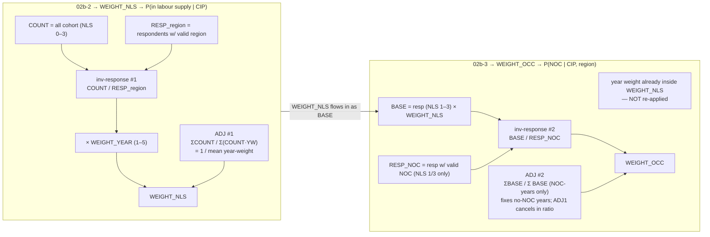

# PSSM Weighting Deep-Dive — Modules 02b-2 & 02b-3

> **Question this doc answers:** In 02b-2 and 02b-3 the weights use an
> *inverse response rate* **twice** and an *adjustment factor (year-level
> collapse)* **twice**. Does that create a double adjustment?
>
> **Short answer:** **No.** The two inverse-response-rate terms correct
> *different* sources of missingness, and the two adjustment factors calibrate
> to *different* population anchors. They look duplicated because the two scripts
> reuse the same 4-stage weighting template, but they operate on distinct
> populations and distinct missingness layers. Details below.

Companion to `project-summary-for-new-analyst.md`. Source of truth:
`R/02b-2-pssm-cohorts-new-labour-supply.R`,
`R/02b-3-pssm-cohorts-occupation-distributions.R`, and the original SQL in
`sql/02b-pssm-cohorts/`.

---

## 1. Why two weighting steps exist at all

The final occupation supply model is a chain of conditional probabilities
(this is the comment at the top of both scripts):

$$
\text{OCCSN}(\text{NOC}) = \underbrace{\text{GRADUATES}(\text{cred, age})}_{04}
\;\times\;\underbrace{P(\text{CIP} \mid \text{cred, age})}_{06}
\;\times\;\underbrace{P(\text{in labour supply} \mid \text{CIP})}_{\textbf{02b-2}}
\;\times\;\underbrace{P(\text{NOC} \mid \text{CIP, region})}_{\textbf{02b-3}}
$$

So the two scripts each produce **one probability**:

| Script | Produces | Denominator (what it's conditional on) |
|---|---|---|
| **02b-2** | $P(\text{in labour supply} \mid \text{CIP})$ | the full CIP cohort (NLS 0–3) |
| **02b-3** | $P(\text{NOC} \mid \text{CIP, region})$ | the **labour-supply** population (NLS 1–3) |

Because the denominators differ, each step needs its **own** weight that
calibrates respondents up to *its own* denominator. That is the structural
reason you see the same template twice.

---

## 2. The shared 4-stage weighting template

Both scripts build a weight with the same shape:

$$
\boxed{\;\text{FinalWeight} = \underbrace{(\text{Base}/\text{Respondents})}_{\text{inverse response rate}}
\;\times\;\underbrace{\text{YearWeight}}_{\text{recency}}
\;\times\;\underbrace{(\Sigma\text{Base}/\Sigma\text{Weighted})}_{\text{adjustment factor}}\;}
$$

| Stage | 02b-2 (NLS weight) | 02b-3 (OCC weight) |
|---|---|---|
| **Base** (numerator of inv. response rate) | `COUNT` = **all** cohort records (NLS 0–3) | `BASE` = respondents (NLS 1–3) `× WEIGHT_NLS` |
| **Respondents** (denominator) | respondents with valid **region** | respondents with valid **NOC** (NLS 1/3 only) |
| **Year weight** | `WEIGHT` (1–5) | (already inside `WEIGHT_NLS` — not re-applied) |
| **Adjustment factor** | calibrates to **raw cohort count** | calibrates to **NLS-weighted labour-supply base** |
| **Final weight** | `WEIGHT_NLS` | `WEIGHT_OCC` |

The *template* is identical; the *populations and missingness layers* are not.

---

## 3. 02b-2 — the NLS weight (`WEIGHT_NLS`)

**Stratum:** $i = (\text{survey, inst, age, grad\_status, ttrain, lcip4\_cred})$, indexed by year $j$.

### Stage A — per stratum × year (`tmp_tbl_weights_nls`, Z02c)

```r
COUNT       = n()                                         # ALL records, NLS 0–3
RESPONDENTS = sum(RESPONDENT==1 & region != -1)           # respondents w/ valid region
WEIGHT_YEAR = WEIGHT                                      # year weight 1–5
WEIGHT_PROB = if_else(RESPONDENTS==0, 1, COUNT/RESPONDENTS)   # ← inverse response rate #1
WEIGHT      = WEIGHT_PROB * WEIGHT_YEAR
WEIGHTED    = RESPONDENTS * WEIGHT                        # = COUNT * WEIGHT_YEAR  (algebraically)
```

$$
\text{WEIGHT\_PROB}_{ij} = \frac{\text{COUNT}_{ij}}{\text{RESP}_{ij}^{\text{region}}}
\qquad
\text{WEIGHTED}_{ij} = \text{COUNT}_{ij}\cdot \text{WEIGHT\_YEAR}_j
$$

> **What inverse-response-rate #1 fixes:** survey non-response + missing region.
> Each respondent is scaled up to stand for the non-respondents in their stratum.

### Stage B — collapse year, compute adjustment factor (Z03 → Z04)

```r
BASE_TOTAL      = sum(COUNT)        # Σ COUNT_j      (raw cohort, all years)
WEIGHTED_TOTAL  = sum(WEIGHTED)     # Σ COUNT_j * WEIGHT_YEAR_j
WEIGHT_ADJ_FAC  = if_else(WEIGHTED_TOTAL==0, 0, BASE_TOTAL/WEIGHTED_TOTAL)   # ← adjustment factor #1
```

$$
\text{ADJ}_1 = \frac{\sum_j \text{COUNT}_{ij}}{\sum_j \text{COUNT}_{ij}\cdot \text{WEIGHT\_YEAR}_j}
= \frac{1}{\text{(count-weighted mean year weight)}}
$$

### Stage C — final NLS weight (Z05)

$$
\boxed{\;\text{WEIGHT\_NLS}_{ij}
= \underbrace{\frac{\text{COUNT}_{ij}}{\text{RESP}_{ij}^{\text{region}}}}_{\text{inv. response #1}}
\;\cdot\;\text{WEIGHT\_YEAR}_j
\;\cdot\;\underbrace{\frac{\sum_j \text{COUNT}_{ij}}{\sum_j \text{COUNT}_{ij}\cdot \text{WEIGHT\_YEAR}_j}}_{\text{ADJ}_1}\;}
$$

**Calibration check** — the stratum's weighted respondent total reconstructs the
**raw cohort count**:

$$
\sum_j \text{RESP}_{ij}\cdot \text{WEIGHT\_NLS}_{ij}
= \sum_j \text{COUNT}_{ij}\cdot \text{WEIGHT\_YEAR}_j \cdot \text{ADJ}_1
= \text{WEIGHTED\_TOTAL}\cdot \text{ADJ}_1
= \text{BASE\_TOTAL}\;\checkmark
$$

> **What ADJ₁ does:** it divides out the *average* year weight so the stratum
> total is anchored to the **raw cohort count**, while the *relative* year
> weights (recency) are preserved inside `WEIGHT_NLS`. This keeps every CIP
> stratum comparable in magnitude (= its true cohort size) for the participation
> rate in §1.

The output `labour_supply_distribution` then computes:

$$
P(\text{in labour supply}\mid\text{CIP, age, region})
= \frac{\text{WEIGHTED}_{\text{NLS 1--3, region}}}{\text{WEIGHTED}_{\text{NLS 0--3, all regions}}}
$$

---

## 4. 02b-3 — the occupation weight (`WEIGHT_OCC`)

**Stratum:** $i' = (\text{survey, region, inst, age, grad\_status, ttrain, lcip4\_cred})$
— **region is now added to the key.** Indexed by year $j$.

> Note: `WEIGHT_NLS` was joined back to records keyed **without** region, so all
> regions within an 02b-2 stratum $i$ share the same `WEIGHT_NLS`. The region
> dimension is introduced fresh here.

### Stage A — NLS-weighted base (Z02a)

```r
BASE = Count(*) * WEIGHT_NLS        # respondents NLS 1–3, × WEIGHT_NLS (carries inv-response #1 + ADJ1)
```

$$
\text{BASE}_{i'j} = \text{COUNT}_{i'j}^{\text{NLS 1--3}}\cdot \text{WEIGHT\_NLS}_{ij}
$$

`BASE` is **already** in NLS-weighted units — it carries inv-response #1 and ADJ₁
forward. 02b-3 does **not** re-apply year weight; it's already inside `WEIGHT_NLS`.

### Stage B — NOC respondents (Z02b)

```text
RESPONDENTS = respondents with NLS∈{1,3} AND valid NOC
              (or in a group that is 100% unknown-NOC)
# note: NLS=2 (studying AND working) is EXCLUDED from the NOC denominator
```

### Stage C — inverse response rate #2 (Z02c)

```r
WEIGHT_NLS_BASE = if_else(RESPONDENTS==0, 1, BASE/RESPONDENTS)   # ← inverse response rate #2
WEIGHTED        = RESPONDENTS * WEIGHT_NLS_BASE                  # = BASE when RESPONDENTS>0, else 0
```

$$
\text{WEIGHT\_NLS\_BASE}_{i'j} = \frac{\text{BASE}_{i'j}}{\text{RESP}_{i'j}^{\text{NOC}}}
$$

> **What inverse-response-rate #2 fixes:** NOC missingness **and** the NLS=2
> exclusion. It upweights NOC-respondents (NLS 1/3 with a known NOC) to cover
> everyone in the NLS-weighted base — including NLS=2 people and NLS 1/3 people
> whose NOC is blank. This is a **different** missingness layer from #1.

### Stage D — collapse year, adjustment factor #2 (Z03 → Z04)

```r
BASE_TOTAL     = sum(BASE)        # Σ BASE_j        (full NLS-weighted labour supply)
WEIGHTED_TOTAL = sum(WEIGHTED)    # Σ BASE_j  only for years with NOC-respondents
WEIGHT_ADJ_FAC = if_else(WEIGHTED_TOTAL==0, 0, BASE_TOTAL/WEIGHTED_TOTAL)   # ← adjustment factor #2
```

$$
\text{ADJ}_2 = \frac{\sum_j \text{BASE}_{i'j}}{\sum_{j:\,\text{RESP}_{i'j}^{\text{NOC}}>0}\text{BASE}_{i'j}}
$$

> **What ADJ₂ fixes:** years/strata where **no one** had a valid NOC. It scales
> up the NOC-bearing years so the final weighted total still equals the full
> NLS-weighted base. Crucially, `WEIGHT_NLS` (and hence ADJ₁) appears in **both**
> numerator and denominator of ADJ₂, so ADJ₁'s *average* effect **cancels** in
> the ratio — ADJ₂ only corrects the no-NOC-year gap.

### Stage E — final OCC weight (Z05)

$$
\boxed{\;\text{WEIGHT\_OCC}_{i'j}
= \underbrace{\frac{\text{BASE}_{i'j}}{\text{RESP}_{i'j}^{\text{NOC}}}}_{\text{inv. response #2}}
\;\cdot\;\underbrace{\frac{\sum_j \text{BASE}_{i'j}}{\sum_{j:\,\text{RESP}>0}\text{BASE}_{i'j}}}_{\text{ADJ}_2}\;}
$$

**Calibration check** — the stratum's weighted NOC-respondent total reconstructs
the **NLS-weighted labour-supply base**:

$$
\sum_j \text{RESP}_{i'j}^{\text{NOC}}\cdot \text{WEIGHT\_OCC}_{i'j}
= \sum_{j:\,\text{RESP}>0}\text{BASE}_{i'j}\cdot \text{ADJ}_2
= \text{WEIGHTED\_TOTAL}\cdot \text{ADJ}_2
= \text{BASE\_TOTAL}\;\checkmark
$$

The occupation distribution is then:

$$
P(\text{NOC}\mid\text{CIP, region})
= \frac{\sum_{j,k}\text{WEIGHTED}_{i'jkn}}{\sum_{j,k,n}\text{WEIGHTED}_{i'jkn}}
$$

— conditional on being in the labour supply (NLS 1–3), exactly as required by
the §1 decomposition.

---

## 5. Side-by-side: the two weighting chains



---

## 6. The double-adjustment question, answered directly

### Are the two inverse response rates double-counting?

**No.** They correct different layers of missingness, on different populations:

| | Inverse response rate **#1** (02b-2) | Inverse response rate **#2** (02b-3) |
|---|---|---|
| Ratio | `COUNT / RESP_region` | `BASE / RESP_NOC` |
| Numerator = | full cohort (NLS 0–3, incl. non-respondents & NLS=0) | NLS-weighted respondents (NLS 1–3) |
| Denominator = | respondents with valid **region** | respondents with valid **NOC** (NLS 1/3) |
| Fixes missingness of… | **survey response / region** | **NOC** (+ the NLS=2 exclusion) |
| Where it lives | inside `WEIGHT_NLS` | `WEIGHT_NLS_BASE` |

#2 does **not** re-upweight for survey non-response — that work is already done
inside `BASE` (via `WEIGHT_NLS`). #2 only extends the upweight to cover the
people `BASE` represents but who have no usable NOC. Sequential layers, not
overlapping ones.

### Are the two adjustment factors double-counting?

**No.** They calibrate to **different anchors**:

| | Adjustment factor **#1** (02b-2) | Adjustment factor **#2** (02b-3) |
|---|---|---|
| Formula | `ΣCOUNT / Σ(COUNT·YW)` | `ΣBASE / Σ BASE_{NOC-years}` |
| Calibrates stratum total to → | **raw cohort count** (NLS 0–3) | **NLS-weighted labour-supply base** (NLS 1–3) |
| Undoes average year weight? | **Yes** (sets scale to raw count) | **No** — `WEIGHT_NLS` is in both num & denom, so ADJ₁ cancels in the ratio; ADJ₂ only patches no-NOC years |

The year weight is applied **once** (in `WEIGHT_NLS`) and preserved *relatively*
thereafter. ADJ₁ sets the absolute scale to the raw cohort; ADJ₂ re-sets the
scale (for the occupation denominator) to the labour-supply base and fills the
no-NOC-year hole. They are not redundant because the two denominators in §1 are
different populations.

### Is anything applied twice in a compounding way?

The only quantity carried from 02b-2 into 02b-3 is `WEIGHT_NLS`, and it is
carried **as a base**, not re-multiplied. Concretely:

$$
\text{WEIGHT\_OCC} = \frac{\text{BASE}}{\text{RESP\_NOC}}\times\text{ADJ}_2
= \frac{\text{COUNT}^{\text{NLS 1--3}}\cdot\text{WEIGHT\_NLS}}{\text{RESP\_NOC}}\times\text{ADJ}_2
$$

`WEIGHT_NLS` appears **once** (inside `BASE`). There is no `WEIGHT_NLS × WEIGHT_NLS`
anywhere. So no compounding.

---

## 7. A tiny worked example

One CIP/age stratum, two years, region = BC, no NLS=2, for simplicity.

| year $j$ | cohort `COUNT` (NLS 0–3) | resp w/ region | resp w/ NOC | `WEIGHT_YEAR` |
|---|---|---|---|---|
| 2022 | 100 | 50 | 40 | 4 |
| 2023 | 100 | 80 | 60 | 5 |

**02b-2** (stratum = both years pooled, no region):

- $\text{ADJ}_1 = (100+100)/ (100\cdot4 + 100\cdot5) = 200/900 = 0.222$
- $\text{WEIGHT\_NLS}_{2022} = (100/50)\cdot 4\cdot 0.222 = 1.778$
- $\text{WEIGHT\_NLS}_{2023} = (100/80)\cdot 5\cdot 0.222 = 1.389$
- Check: $50\cdot1.778 + 80\cdot1.389 = 88.9 + 111.1 = 200 =$ raw cohort ✓

**02b-3** (stratum = this region; `BASE = resp_NLS1-3 × WEIGHT_NLS`; assume
resp_NLS1-3 = resp_region here):

- $\text{BASE}_{2022} = 50\cdot1.778 = 88.9$; $\text{BASE}_{2023}=80\cdot1.389=111.1$
- inv-response #2: $88.9/40 = 2.22$; $111.1/60 = 1.85$
- $\text{ADJ}_2 = (88.9+111.1)/\text{WEIGHTED\_TOTAL}$. Both years have NOC resp, so $\text{WEIGHTED\_TOTAL}=88.9+111.1=200$, $\text{ADJ}_2=1.0$ (no no-NOC hole to patch).
- $\text{WEIGHT\_OCC}_{2022}=2.22$; $\text{WEIGHT\_OCC}_{2023}=1.85$
- Check: $40\cdot2.22 + 60\cdot1.85 = 88.9+111.1 = 200 =$ NLS-weighted base ✓

If 2022 had **zero** NOC respondents, $\text{WEIGHTED\_TOTAL}=111.1$ only,
$\text{ADJ}_2 = 200/111.1 = 1.8$, and 2023's NOC respondents would be scaled up
to cover 2022's missingness — that is precisely what ADJ₂ is for.

---

## 8. Caveats worth knowing (not bugs, but approximations)

1. **Region introduced late.** `WEIGHT_NLS` is computed **without** region in the
   key (02b-2), then 02b-3 adds region. So within one 02b-2 stratum, all regions
   share the same survey-non-response upweight (#1), even though response rates
   differ by region. The NOC upweight (#2) is computed at region level and partly
   compensates, but region-specific survey non-response is not fully captured.
   This is a known approximation inherited from the original SQL.

2. **NLS=2 handling.** NLS=2 (studying AND working, DACSO only) is in the
   02b-2 cohort (so represented in `WEIGHT_NLS`) and in the 02b-3 `BASE`, but is
   excluded from `RESP_NOC`. So NOC-respondents stand in for NLS=2 people's
   occupations. Intentional — NLS=2 people are part of labour supply but their
   NOC isn't a clean signal.

3. **`WEIGHT_ADJ_FAC` naming collision.** Both scripts call their adjustment
   factor `WEIGHT_ADJ_FAC`, but they are **different objects** in different
   tables (`tmp_tbl_weights_nls` vs `dacso_q008_z04_weight_adj_fac`).
   Don't assume they're the same number.

4. **The R comments are honest about uncertainty.** E.g. 02b-3 line ~239: the
   author writes "I believe what this is doing is up-weighting the NLS=2 group
   into the NLS=1,3 group" — that matches the analysis above (inv-response #2
   covers NLS=2 + missing-NOC). If you refactor, preserve this behaviour.

---

## 9. TL;DR for the next analyst

- The two scripts share a 4-stage template: **inverse response rate × year weight × adjustment factor**, calibrated so each stratum's weighted total equals a chosen anchor.
- 02b-2 anchors to the **raw cohort** (NLS 0–3) → produces `WEIGHT_NLS` and $P(\text{labour supply}\mid\text{CIP})$.
- 02b-3 anchors to the **NLS-weighted labour-supply base** (NLS 1–3) → produces `WEIGHT_OCC` and $P(\text{NOC}\mid\text{CIP, region})$.
- The "double" inverse response rate is **not** double counting: #1 = survey/region non-response, #2 = NOC missingness (+ NLS=2 exclusion).
- The "double" adjustment factor is **not** double counting: #1 undoes the average year weight (→ raw count), #2 patches no-NOC years (→ labour-supply base); ADJ₁ cancels inside ADJ₂'s ratio.
- Year weights are applied **once** and carried relatively; nothing is squared or re-multiplied.
